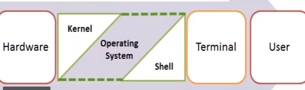
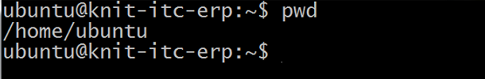

### Shell scripting ###
 
The Shell wraps around the delicate interior of an Operating system protecting it from accidental damage. Hence the name ShellM 

When you run the terminal(ctl+alt+T), the Shell issues a command prompt (usually $) 

Each operating system  has a command language interpreter processor which executes its commands read from the standard input or from a file . In linux/Unitx command processor known as shell(a program that executes other programs)

Note : here input pwd

### Types of Shell ###
1. `Bourne Shell (sh)`:  Bourne Shell  is the original unix shell developed at Bell Labs by Stephen Bourne. It prompt as $, execute on command .sh

2. `Bourne Again Shell (bash)` : It is the free version of Bourne shell  with some more advanced features found in the C, TC and Korn shells.its most popular shell and default shell of unit/linux os . Bash is inteded to be a conformant implementation of the shell IEEE POSTX specification(IEEE 1003.1)

3. `Korn shell(ksh)` : korn shell is the unix shell developed by David korn of Bell labs. Is is considered as the family member of Bourne shell as it uses the $ symbol of Bourne shell and execute on command .ksh.

4. `C Shell (csh)` : C shell is the UNIX shell created by Bill joy at California university as an alternative to Bourne shell . It based on C language. It prompt as %, execute on command .csh

5. `Tab C chell (tcsh)` : It is the family member of  C shell with additional features like enhanced history substitution to reuse commands, spelling correction and word completion

6. `Z shell (Zsh)` : Zsh is an extended Bourne shell with a large number of improvements, including some features of Bash, ksh, and tcsh
1. Bourne Shell (sh):  Bourne Shell  is the original unix shell developed at Bell Labs by Stephen Bourne. It prompt as $, execute on command .sh

2. Bourne Again Shell (bash) : It is the free version of Bourne shell  with some more advanced features found in the C, TC and Korn shells.its most popular shell and default shell of unit/linux os . Bash is inteded to be a conformant implementation of the shell IEEE POSTX specification(IEEE 1003.1)

3. Korn shell(ksh) : korn shell is the unix shell developed by David korn of Bell labs. Is is considered as the family member of Bourne shell as it uses the $ symbol of Bourne shell and execute on command .ksh.

4. C Shell (csh) : C shell is the UNIX shell created by Bill joy at California university as an alternative to Bourne shell . It based on C language. It prompt as %, execute on command .csh

5. Tab C chell (tcsh) : It is the family member of  C shell with additional features like enhanced history substitution to reuse commands, spelling correction and word completion

6. Z shell (Zsh) : Zsh is an extended Bourne shell with a large number of improvements, including some features of Bash, ksh, and tcsh

It has some unique features that include:

    1. Filename generation
    2. Startup files
    3. Login/Logout watching
    4. Closing comments
    5. Concept index
    6. Variable index
    7. Functions index
    8. Key index and many more that you can find out in man pages

7. Fish( in full stands for):  It was intended to be fully interactive and user friendly, just like the other shells, it has some pretty good features that include:

    2. Web based configuration
    3. Auto-suggestions
    4. Fully scriptable with clean scripts
    5. Support for term256 terminal technology

###  Shell type Usefull command ###
1. `cat /etc/shells` : Show all available shell     
 
2. `echo $0` : Show default shell  
 
