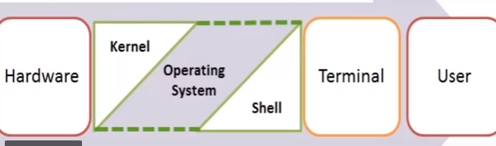
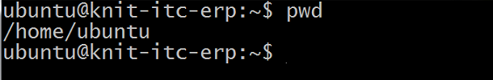

### Shell scripting ###

The Shell wraps around the delicate interior of an Operating system protecting it from accidental damage. Hence the name ShellM 

When you run the terminal(ctl+alt+T), the Shell issues a command prompt (usually $) 

shell in a Linux operating system takes input from you in the form of commands, processes it, and then gives an output

Note : here input pwd
